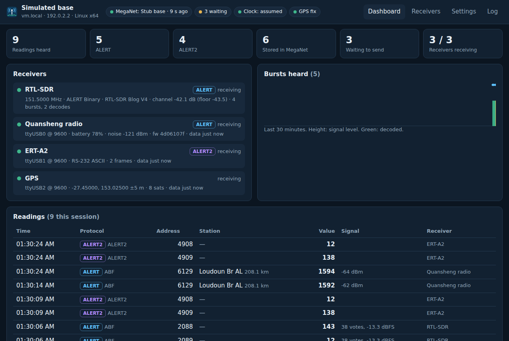
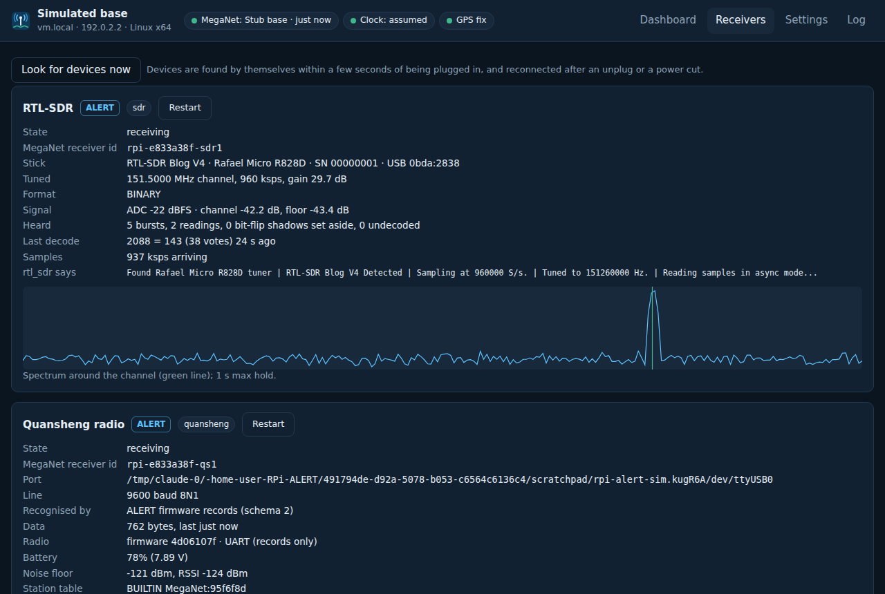
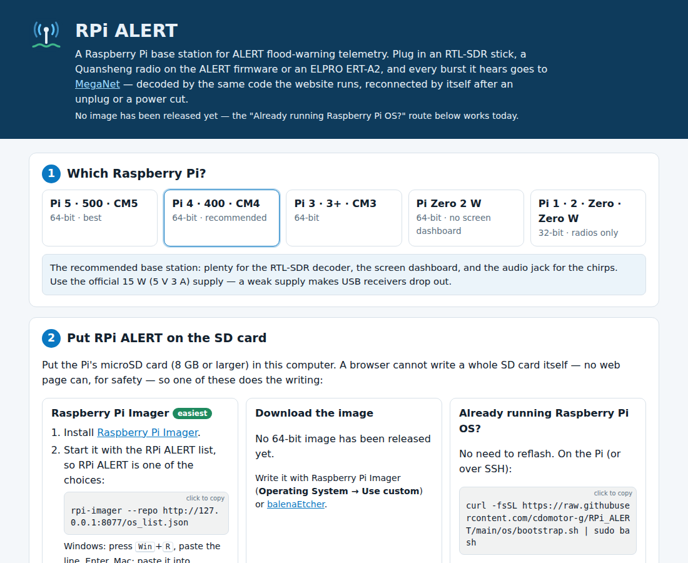

# RPi ALERT

A Raspberry Pi operating system for **ALERT flood-warning base stations**. Plug in a
receiver, give the Pi power and a network, and every ALERT or ALERT2 burst it hears is
decoded and posted to [MegaNet](https://github.com/cdomotor-g/MegaNet)
(floodwarning.net). It starts by itself, finds its receivers by itself, and reconnects by
itself after an unplug or a power cut.

```
 field stations ──VHF──▶  RTL-SDR stick ─────────┐
                          Quansheng UV-K5/K1 ─────┤  USB   Raspberry Pi            HTTPS
                          ELPRO ERT-A2 ───────────┤ ────▶  RPi ALERT agent  ────────────▶  MegaNet
                          USB GPS (optional) ─────┘        dashboard · speaker · queue      ingest_http()
```

**→ Set up a base station: <https://cdomotor-g.github.io/RPi_ALERT/>** — pick your Pi, write the card, write its settings.



## What it does

| | |
|---|---|
| **Receivers** | **RTL-SDR** sticks (Blog V2, V3, V4, any RTL2832U) decoding off the air · **Quansheng** UV-K5 V3 / UV-K1 on the [ALERT receiver firmware](https://github.com/cdomotor-g/quansheng_alert_v3) (USB-C, schema 2) and the older [DP32G030 firmware](https://github.com/cdomotor-g/quansheng_alert) (programming cable, 38400) · **ELPRO ERT-A2** (RS-232 ALERT2 ASCII at 9600, or its USB binary framing) · any **NMEA GPS** |
| **ALERT and ALERT2** | Each device is recognised from what it sends and every reading is tagged with its protocol: legacy **ALERT** (300-baud AFSK — ALERT Binary, Enhanced iFLOWS, ASCII) from SDRs and radios, **ALERT2** from the ERT-A2. |
| **Several channels on one stick** | A stick hears a whole slice of the band at once, and every ALERT channel in it is decoded at the same time — each with its own decoder thread, and each a receiver of its own in MegaNet. The channels MegaNet's stations use (151.500, 151.525, 151.950 and 152.400 MHz) fit one stick: list them, `151.5, 151.525, 151.95, 152.4`. The agent picks the sample rate and where to tune so that the DC spike and a zero-IF tuner's mirror images stay off every channel. |
| **Several sticks** | Each RTL-SDR stick can have its own channels, format, gain, ppm and bias tee — for networks further apart than one stick hears (about 1.9 MHz). Sticks that share a serial number, as most do, are told apart by their USB port, and each `rtl_sdr` is checked to have opened its own stick. Plugging in another stick never renames or restarts the ones running; an unplugged one stays listed until you remove it. |
| **Same decoders as MegaNet** | The Pi runs MegaNet's own `alert-dsp.js`, `quansheng.js`, `alert2.js` and `serial-gps.js` (vendored verbatim), so a burst decodes on the Pi exactly as it does on floodwarning.net. |
| **MegaNet** | Posts through `ingest_http()` with one ingest token per Pi, one receiver id per device (`serial-monitor/rpi-<host>-qs1`), each reading with the frequency it was heard on and its signal — RSSI, or an SDR's level, and SNR — for the Message Log's Freq, Signal and SNR columns; describes each receiver through `report_ingest_point()` and every frame heard through `report_receptions()` (the Reception Map) — the contract MegaNet's Serial Monitor already uses. Falls back from the floodwarning.net proxy to Supabase directly. |
| **Its token, without typing it** | Press **Request a token** on the Pi (or `rpi-alert request-token`, or `request_token = yes` on the SD card): it shows a code and a QR code, an administrator signed in to MegaNet on their phone approves it on the Admin tab, and the Pi starts sending within seconds. Nobody signs in on the Pi and nothing is copied: the Pi makes the token and MegaNet keeps only its hash. |
| **Never loses a reading** | A queue on disk survives restarts and power cuts. No internet: kept and sent later — for days, since it is bounded by the SD card (1 GB by default), not by memory. No clock yet (a Pi has no RTC): held on the monotonic clock and stamped once NTP, a GPS or a battery RTC (Pi 5, or an RTC board) gives the time. |
| **Site surveys** | Leave a Pi at a candidate repeater or base-station site for a day or three, network or not: the dashboard's **Survey** page says whether it is ready to be left (receivers, location, clock, room on the card, power), tallies every station it hears — good and bad frames, signal, SNR — and, back on a network, what it heard goes to MegaNet as receptions for the Reception Map's **Site surveys** panel to set beside what the network itself received. [docs/survey.md](docs/survey.md) |
| **Reconnects** | USB ports are rescanned every 2 s; a device that hangs up is reopened when it returns (under any `/dev` name); `rtl_sdr` is restarted if it stalls or exits; the Quansheng's DTR is toggled when it goes quiet; systemd restarts the agent; the hardware watchdog reboots a hung Pi. |
| **Screen, keyboard, mouse** | Plug in a monitor and the dashboard comes up full screen (cage + Chromium); unplug it and the kiosk stops. Everything is settable from it. |
| **No network at all** | Its own Wi-Fi network comes up after three minutes with none — join **RPi-ALERT-…** from a phone and open `http://10.42.0.1/` — and gives way the moment Ethernet or a known Wi-Fi network is there. |
| **Headless** | The same dashboard on `http://rpi-alert.local/` from any computer on the network, `rpi-alert setup` / `status` / `top` over SSH (PuTTY), or an `rpi-alert.conf` file dropped on the SD card's boot partition. |
| **Managed from MegaNet** | Checks in with MegaNet's **Base Stations** tab once a minute — MegaNet never connects to it — so its health is on one list with every other base station, and an administrator can change its settings, restart it, install updates and read its log from there. Never the token, where readings go, the web password or SSH keys; `report` or `off` on the Pi narrows or ends it. [docs/remote-management.md](docs/remote-management.md) |
| **Getting in, years later** | The same maintenance account on every Pi, **`alert`**, with no password: SSH keys only, each a person's, listed on the Pi — from the SD card, a team's GitHub accounts, or MegaNet's team keys. Nobody leaves with the only password. Locked out? `alert_password` on the SD card. [docs/access.md](docs/access.md) |
| **Chirps** | A speaker on the audio jack plays each burst: an SDR's real demodulated audio, or a re-synthesised ALERT burst for radios and ERT-A2s. |
| **GPS** | A USB GPS, when there is one, becomes the base station's location (the only one MegaNet records as exact) and its clock when there is no internet. Until then, a fixed location. |

## Three ways to install

1. **Raspberry Pi Imager** with the RPi ALERT repository (Imager customisation — user,
   Wi-Fi, SSH — works as normal):
   ```
   rpi-imager --repo https://cdomotor-g.github.io/RPi_ALERT/os_list.json
   ```
2. **Download the image** from [Releases](https://github.com/cdomotor-g/RPi_ALERT/releases) and
   write it with Imager's *Use custom* or balenaEtcher.
3. **On a Pi already running Raspberry Pi OS** (Trixie or Bookworm, Lite or Desktop) —
   no reflash:
   ```
   curl -fsSL https://raw.githubusercontent.com/cdomotor-g/RPi_ALERT/main/os/bootstrap.sh | sudo bash
   ```

Then open **http://rpi-alert.local/** (or the Pi's own screen), press **Request a token**,
and approve it from your phone on MegaNet's **Admin** tab after checking the code matches —
scanning the QR code on the Pi opens the request. Set the location. Over SSH: `ssh alert@rpi-alert.local`
with a key you gave it on the set-up page. Details: [docs/install.md](docs/install.md).

> **Why not flash from the web page?** No browser can write a whole SD card — WebUSB
> refuses USB storage and the File System Access API cannot open raw disks, by design.
> So the web page does everything around it: picks the image, starts Imager with this
> repository, and writes the card's settings file straight onto its boot partition (Chrome
> and Edge). A Pi 4/5 with no other computer can use Raspberry Pi's *network install*
> (hold Shift at boot) to flash Raspberry Pi OS Lite, then run the one-line installer.
> More in [docs/research.md](docs/research.md).

## Supported Raspberry Pis

| Pi | Image | RTL-SDR decoding | Screen dashboard | Audio jack |
|---|---|---|---|---|
| 5, 500, CM5 | 64-bit | ✓ (960 ksps) | ✓ | — use HDMI or USB audio |
| **4, 400, CM4** (recommended) | 64-bit | ✓ (960 ksps) | ✓ | ✓ |
| 3, 3+, CM3 | 64-bit | ✓ (960 ksps) | ✓ (1 GB) | ✓ |
| Zero 2 W | 64-bit | ✓ (240 ksps) | — (512 MB) | — USB audio |
| 1, 2, Zero, Zero W | 32-bit | — too slow; radios and ERT-A2 only | — | Pi 1/2 ✓ |

Hardware notes, including the RTL-SDR V4 and power supplies: [docs/hardware.md](docs/hardware.md).

## The repository

```
agent/            the RPi ALERT agent (Node.js, no npm dependencies)
  bin/rpi-alert     daemon + command line (status, top, setup, token, config, remote, access, …)
  bin/rpi-alert-access  the root helper for SSH access (the alert account's keys)
  lib/              devices (serial ports, sniffing, drivers, SDR), uplink, token request, remote
                    management, SSH access, clock, web server
  vendor/meganet/   MegaNet's decoders, verbatim (see SOURCE; scripts/sync-meganet.sh)
  web/              the dashboard and settings page (and qr.js, its QR codes)
  test/             node --test: real off-air vector, protocol vectors, MegaNet stand-in,
                    pty receivers, a fake rtl_sdr, the whole agent end to end
  scripts/          simulate.sh (a base station with no hardware), sync-meganet.sh
os/               install.sh (Pi or image chroot), bootstrap.sh, systemd units, udev,
                  sudoers, the root helper, kiosk, updater, boot-partition files
build/            build-image.sh — Raspberry Pi OS Lite + install.sh in a qemu chroot
site/             the GitHub Pages set-up page (and the Imager repository, os_list.json)
docs/             install, configuration, remote management, SSH access, hardware, how it works,
                  research, roadmap, bench test
```

## Developing

```sh
cd agent
node --test test/*.test.js       # 119 tests; the pty and serial end-to-end ones need socat, one sshd
scripts/simulate.sh [sticks]     # a simulated base station on http://localhost:8099/ (1–4 RTL-SDR sticks)
scripts/simulate.sh --channels   # …with the first stick on the air on four channels at once
```

Building an image needs Linux with root, `qemu-user-static` (binfmt), `fdisk`, `xz` and
`python3`: `sudo build/build-image.sh [--arch armhf]`. CI builds both and publishes them as a release on a `v*` tag, or from
**Actions → build-image → Run workflow** with a release tag ([.github/workflows](.github/workflows)).

 

Site surveys: [docs/survey.md](docs/survey.md) ·
How it fits together: [docs/how-it-works.md](docs/how-it-works.md) ·
Settings reference: [docs/configuration.md](docs/configuration.md) ·
MegaNet's Base Stations tab: [docs/remote-management.md](docs/remote-management.md) ·
SSH access: [docs/access.md](docs/access.md) ·
What is next: [docs/roadmap.md](docs/roadmap.md) ·
First test on the bench Pi: [docs/bench-test.md](docs/bench-test.md)

## Licence

MIT. The vendored decoders are MegaNet's (MIT); the off-air decoder is a port of
[agmurf/sdr-alert-decoder](https://github.com/agmurf/sdr-alert-decoder) (MIT).
