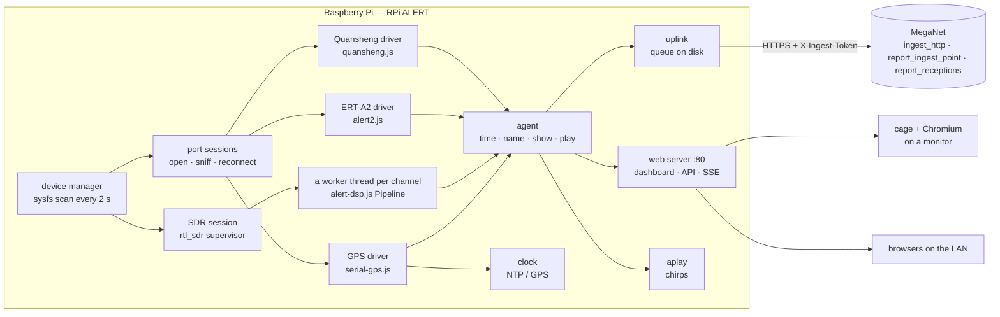

# How it works



## The operating system

RPi ALERT is **Raspberry Pi OS Lite** (currently Trixie) with the agent installed by
[`os/install.sh`](../os/install.sh) — the same script that installs it on a running Pi. Nothing
of Raspberry Pi OS is replaced, so kernels, firmware, Wi-Fi drivers and security updates come from
Raspberry Pi as usual, and Raspberry Pi Imager's customisation (cloud-init) works unchanged.
"Lightweight" here means Lite (no desktop) plus only what the base station uses: Node.js, `rtl-sdr`,
ALSA utilities, Avahi, and — only for the screen — `cage` (a single-app Wayland compositor) and
Chromium. The image turns off Bluetooth and triggerhappy, and caps the journal at 64 MB.

| Piece | What it is |
|---|---|
| `rpi-alert.service` | The agent, as user `rpi-alert` (groups dialout, plugdev, audio, video), port 80 through `CAP_NET_BIND_SERVICE`. `Restart=always`. |
| `rpi-alert-boot-config.service` | Applies `rpi-alert.conf` from the boot partition before the agent starts. |
| `rpi-alert-kiosk.service` | cage + Chromium on tty7, started and stopped *by the agent* as a monitor is connected and disconnected (`/sys/class/drm/*/status`), so a headless Pi spends no memory on it. |
| `/opt/rpi-alert/libexec/rpi-alert-priv` | The only thing the agent may run as root (sudoers): a fixed list of verbs — kiosk, reboot, Wi-Fi, hostname, time zone, set the clock from GPS — each argument checked. |
| udev / modprobe | RTL-SDR permissions, USB autosuspend off for receivers, ModemManager kept off serial receivers, DVB-T driver blacklisted. |
| Hardware watchdog | `RuntimeWatchdogSec=15`: a hung Pi reboots itself. |
| `/etc/issue.d`, `/etc/profile.d` | The console and SSH logins say where the dashboard is. |

## Finding receivers, and finding them again

Every two seconds the device manager lists `/dev/ttyACM*`, `/dev/ttyUSB*` and any extra ports, with
their USB ids from sysfs and their `/dev/serial/by-id` names, and the RTL2832U sticks on the USB bus.

- **A new serial port** gets a session. Its identity is its by-id name (vendor, model, serial
  number), so it is the same receiver — with the same MegaNet receiver id — however the kernel
  numbers it, across replugs and reboots.
- **What is it?** Settings first (a per-port override), then the USB id (36B7 is the Quansheng
  ALERT firmware), then **what it sends** ([`sniff.js`](../agent/lib/devices/sniff.js)):
  `ALERT2A,` lines or `ALERT2` binary frames → ERT-A2; `HDR/DEC/BST/STA/EVT` records or
  `ALERT,<id>,<value>` lines → Quansheng; `$GPGGA`/`$GNRMC` → GPS. On a USB-serial adapter, line
  noise (non-text bytes, no line ends) moves it to the next speed (9600 → 38400 → 115200 → …);
  silence does not — an ERT-A2 can be quiet for an hour. The bytes that identified the device are
  handed to its driver, so the first reading is not lost.
- **Serial I/O** is plain Node: the tty is opened non-blocking, configured with `stty` while held
  open, and polled — no native module to build, and nothing that can wedge a thread. A read that
  returns 0 bytes, EIO or ENODEV is a hang-up. HUPCL means closing drops DTR and reopening raises it,
  which is how the Quansheng's DTR is toggled.
- **Lost a device?** The session closes the port and retries (1, 2, 5, 10, 30 s) while the device
  node exists; once it is gone the session waits, and the scan reopens it the moment it reappears.
- **RTL-SDR**: `rtl_sdr` streams u8 IQ to the agent, which hands it to a worker thread running
  MegaNet's `AlertDsp.Pipeline` (channeliser, burst gate, decode, spectrum, FM audio) — one for each
  channel the stick listens on, every one fed the same stream and set to its own channel's offset
  from where the stick is tuned. So one stick decodes every channel in its slice of the band at
  once, each a receiver of its own (its own MegaNet receiver id, counts, gate, squelch and format),
  and a burst on one channel never waits for a decode on another: they run on separate cores.
  [`sdr-plan.js`](../agent/lib/devices/sdr-plan.js) picks the sample rate and the centre — the
  lowest of the decoder's rates that holds the channels, and the centre that keeps the DC spike and
  every mirror image furthest from all of them. Ten seconds with no samples kills `rtl_sdr`; any exit
  restarts it (2 s doubling to 30 s) while the stick is present. A decoder that falls behind drops
  input rather than memory.
- **Which stick is which** ([`state.js`](../agent/lib/state.js)): every stick seen is remembered in
  `/var/lib/rpi-alert/state.json` with what it says it is (USB ids, maker, model, serial) and its USB
  port (`1-1.3`), and each scan matches what is plugged in against that — same stick in the same
  port; else the same kind of stick that is missing, moved; else a new stick — never against what
  else is plugged in, so a second stick neither renames nor restarts the first even when both say
  they are serial `00000001`. Each has its own receiver id and its own settings
  (`receivers.sdrDevices`, by key); each of its more channels has the stick's id and its frequency
  (`rpi-<host>-sdr1-151.525`), so it keeps its id whatever other channels come and go. An unplugged
  stick stays listed until it returns or is removed.
- **Pointing `rtl_sdr` at it** ([`rtl-index.js`](../agent/lib/devices/rtl-index.js)): `-d` takes a
  serial or a device number, and librtlsdr numbers the sticks in libusb's order — udev's device-path
  order, reversed, since libusb puts each device it finds at the head of its list. The agent uses
  the stick's serial when no other stick has it and `rtl_sdr` cannot read it as a number (it tries
  `strtol(…, 0)` first: `00000001` is device 1); otherwise the device number it predicts, narrowed by
  the device list `rtl_sdr` prints and by what it has already learnt. Once samples flow it reads
  which `/dev/bus/usb/BBB/DDD` node the process holds (`/proc/<pid>/fd`): the wrong stick is closed
  and the right number used; a number that was busy is another stick's, so the next is tried. A
  running `rtl_sdr` keeps its stick when others come and go.

## ALERT and ALERT2

| | Legacy **ALERT** | **ALERT2** |
|---|---|---|
| On air | 300-baud AFSK on narrowband FM | 4800 bps, a different modulation and framing |
| Frame formats | ALERT Binary (no check), Enhanced iFLOWS (CRC-6), ALERT ASCII | IND 0x74 "ALERT concentration" element: seconds-since-midnight + 4-byte records |
| Heard by | RTL-SDR (decoded on the Pi, every channel in the stick's slice at once), Quansheng radio (decoded on the radio) | ELPRO ERT-A2 (decoded on the receiver) |
| Reading | `protocol: "alert"`, format shown as ABF / EIF / ASCII | `protocol: "alert2"` |

Both carry the same 13-bit ALERT address and 11-bit value, which is why MegaNet stores them in one
table. Decoding ALERT2 off the air with an RTL-SDR is on the [roadmap](roadmap.md).

## A reading's life

1. A driver decodes it (alert_id, value, protocol, format, signal, the raw line).
2. **Time.** A live reading is timed by its arrival (as MegaNet's Serial Monitor does) — except an
   ALERT2 frame, which carries its own time of day. If the Pi's clock is not yet trusted (no NTP
   since boot, no GPS), the reading is **held** with a CLOCK_MONOTONIC stamp and this boot's id,
   and timed when the clock is trusted: `now − (monotonic now − monotonic then)`. One held across a
   reboot that never saw a good clock cannot be placed and is dropped (counted, logged).
3. **Named** from MegaNet's register (`stations.json`, refreshed daily, cached): the station(s)
   carrying that address, nearest first when the Pi's location is known.
4. **Shown** (dashboard, SSE), **played** (live audio or a re-synthesised burst), **queued**.
5. **Sent**: every 5 s (sooner when 500 wait), one receiver and protocol per batch, ≤ 1,000:
   ```json
   POST {endpoint}/rpc/ingest_http
   apikey: sb_publishable_…   X-Ingest-Token: mgn_…   Content-Profile: meganet
   {"payload": {"source": "serial", "protocol": "alert", "path": "serial-monitor/rpi-3f9a1c2e-qs1",
                "frame": "DEC,1041,…", "readings": [{"alert_id": 2088, "reading_ts": 1790843886000, "value_raw": 143}]}}
   ```
   MegaNet deduplicates on address + time + raw value, so retrying is always safe, and a reading heard
   by two receivers is stored once with both paths. 200 → done. 401/403 → the token is refused:
   stop, keep everything, say so, resume the moment a new token is saved. 400 → this agent misread
   the contract: drop the batch, log it. Anything else or no answer → keep, back off 10 s doubling
   to 5 min. Endpoints: the floodwarning.net `/api/db` proxy first (it gets through networks that block
   `*.supabase.co`), then Supabase directly; the one that works is remembered.
6. **The queue** (readings, receptions, held readings) is on disk in `/var/lib/rpi-alert/queue.json`,
   written two seconds after it changes and deleted when empty.

Alongside, each receiver **describes itself** to `report_ingest_point` (on start, on any change,
and every 15 minutes): its point id `rpi-<host>-<qs|ert|sdr><n>`, name, kind, device detail
(firmware, tuner, frequency, format…) and location, with its source — `gps` (exact) or `manual` /
`station` (approximate, as MegaNet's constraint requires). And **every frame heard** — good, bad,
bit-flip shadows, undecoded bursts — goes to `report_receptions` with RSSI or level and position:
the raw material of MegaNet's Reception Map.

## Getting the token

A base station needs an ingest token before MegaNet will take its readings, and it **asks for
one** rather than having one typed into it (MegaNet's device grant, its migration `0048` — the
way a television signs in to a streaming service):

1. *Request a token* (dashboard, `rpi-alert request-token`, or `request_token = yes` on the SD
   card): the agent draws `mgn_` + 64 hex characters from the kernel's random number generator and
   sends them to `request_ingest_token` in `X-Ingest-Token` — the header every later call carries
   — with the base station's name and what is plugged in. MegaNet keeps only the hash and answers
   with a code, `WDJB-MJHT`, good for half an hour.
2. The Pi shows the code and a QR code of `https://floodwarning.net/#pair=WDJB-MJHT`, which opens
   MegaNet's Admin tab on that request.
3. An administrator signed in to MegaNet anywhere checks the code and presses *Approve*. The agent
   asks `ingest_token_request_status` every five seconds; on `approved` the token it made becomes
   `meganet.token`, and the queue goes. On `denied` or `expired` it says so (and, asked to keep
   asking, makes a new token and a new request). With no answer at all it keeps asking, slower —
   only MegaNet can say a request is over.

The token never leaves the Pi except in the header it always travels in, nothing secret is shown
or typed, and the code only says which request is this one — which is why the administrator
checks it: anyone can ask, and the code is how they know they are approving the Pi in front of
them. Until approval the token waits in `/var/lib/rpi-alert/token-request.json` (0600), so a
restart carries on asking.

## Clock

A Pi has no battery clock (a Pi 5 can have one) and boots at the time it last shut down. The agent
trusts the clock when systemd-timesyncd says it is synchronised
(`/run/systemd/timesync/synchronized`, or `timedatectl`'s NTPSynchronized), or when a GPS gives a
valid time (and then also sets the system clock, at most every ten minutes, never to before 2025 —
GPS week-rollover bugs). The Quansheng radio's own clock is set from the Pi's once it is trusted.

## Security

- The agent is not root. Root actions go through one helper with a fixed verb list.
- The ingest token lives in a 0600 file owned by the agent and is never sent back out by the API.
  It is made on the Pi (when it asks MegaNet for one) and MegaNet only ever stores its hash.
- The web page: the Pi's own screen and shell are trusted; from the network, a password once set
  (scrypt-hashed; sessions are HttpOnly SameSite=Strict cookies; changes must be JSON — which a
  cross-site form cannot send — and same-origin; login attempts are rate-limited). It is plain HTTP
  on the local network, like any router's set-up page; do not expose port 80 to the internet.
- A token is a credential for the whole network's write access (MegaNet's docs say so). Revoke it on
  MegaNet's Admin tab the day the Pi leaves your control.

## Why Node.js, with no npm dependencies

MegaNet's decoders are JavaScript, and three of the four already run under Node (MegaNet's own tests
do it). Running them verbatim means the Pi cannot drift from the website. Everything else — serial
ports, HTTP, the web server, workers — is Node's standard library, so an install is a file copy plus
`apt install nodejs`: nothing to compile on a Pi, nothing to break on an upgrade.
